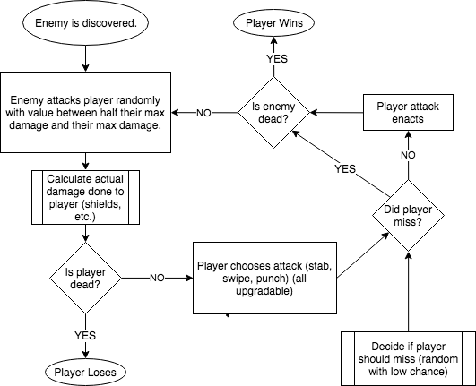

#  FuseBlade - Theory

## Problem Definition

FuseBlade is a *Tile-Based RPG Adventure Game* That takes place on an island.
The problem that this software solves is boredom, as is the nature of most games.
To solve this problem we will make a coherent working game that
will include the following features:
- A large 100x100 map loaded in from a file
- A spritesheet to handle all the textures
- An animated Character that can move
- Enemies
    - Enemy AI
    - Enemy stats and textures
    - random spawning of enemies
- Combat and Combat UI
- Leveling up
- Player and enemy death
- Player respawning and saving

## System Flow Chart

## Gantt Chart

| Task                     | W1| W2| W3| W4| W5| W6|
| --:                      |:-:|:-:|:-:|:-:|:-:|:-:|
| Problem Definition       |▒✓▒|   |   |   |   |   |
| System Flow Chart        |▒✓▒|   |   |   |   |   |
| Gantt Chart              |▒▒▒| ✓ |   |   |   |   |
| Data Dictionary          |   |   |   |   |   |▒✓▒|
| Setup and Framework Init |   |▒▒▒|▒▒▒| ✓ |   |   |
| Map                      |   |▒▒▒|▒▒▒| ✓ |   |   |
| Character Function       |   |   |▒▒▒|   | ✓ |   |
| UI Popups                |   |   |   |▒▒▒| ✓ |   |
| Combat                   |   |   |   |   |▒▒▒|▒✓▒|
| Enemies                  |   |   |   |   |▒▒▒|▒✓▒|
| Saving                   |   |   |   |   |   |▒✓▒|
| Development Journal      |▒▒▒|▒▒▒|▒▒▒|▒▒▒|▒▒▒|▒✓▒|
| Personal Reflection      |   |   |   |   |   |▒✓▒|

## Data Dictionary

| Field Name | Data Type | Data Format | Field Size | Description | Example |
| --:       | :-:       | :-:         | :-:        | ---         | :--     |
| PLAYER\_SPEED | Float | (primitive) | 8 bytes | Player movement speed in pixels/second | 20 |
| CAM\_ZOOM | Float | (primitive) | 8 bytes | Camera Zoom Level | 5 |
| CAM\_MODE | String | (primitive) | 6 bytes | Camera follow type that determines how the camera will act | &quot;smooth&quot; |
| CAM\_LIMIT | Float | (primitive) | 8 bytes | The camera pan distance limit | 100 |
| FIGHT\_BOX\_WIDTH | Float | (primitive) | 8 bytes | Width of the fight box UI | 100 |
| FIGHT\_BOX\_HEIGHT | Float | (primitive) | 8 bytes | Height of the fight box UI | 70 |
| ENEMY\_COUNT | Float | (primitive) | 8 bytes | Amount of enemies that will spawn on the map | 100 |
| ENEMY\_AGRO\_DIST | Float | (primitive) | 8 bytes | Base number for how far away the player needs to be from an enemy for it to start following the player | 5 |
| ENEMY\_SPEED | Float | (primitive) | 8 bytes | default enemy movement speed in pixels/second | 10 |
| PLAYER\_ENABLED | Bool | (primitive) | 8 bytes | Whether the player can move or not | True |
| DEBUG\_ENABLED | Bool | (primitive) | 8 bytes | Whether the debug tools are enabled or not | False |
| PLACEMENT\_TILES | Array(int) | [NNN, NNN, …] | 120 | The locations that enemies can spawn (max 15 tiles) | [123, 123, 321] |
| ENEMY\_TYPES | Array(string) | [WORD, WORD, …] | 80 | The list of different enemy types (max 8 enemies) | [&quot;funny&quot;, &quot;words&quot;, &quot;here&quot;] |
| ENEMY\_DATA | Object | ___{ enemyName:___ _{ stats: { speed: enemySpeed, sight:enemySight, attack:enemyAttack}, frame: enemyFrameName}_, ___enemyName2:___ _{...}____}___ | 10 | The object that contains all the data and stats of all the different enemy types | {"Skeleton": stats:{speed:10, sight:5, attack:5}, frame: "skeleton"} |